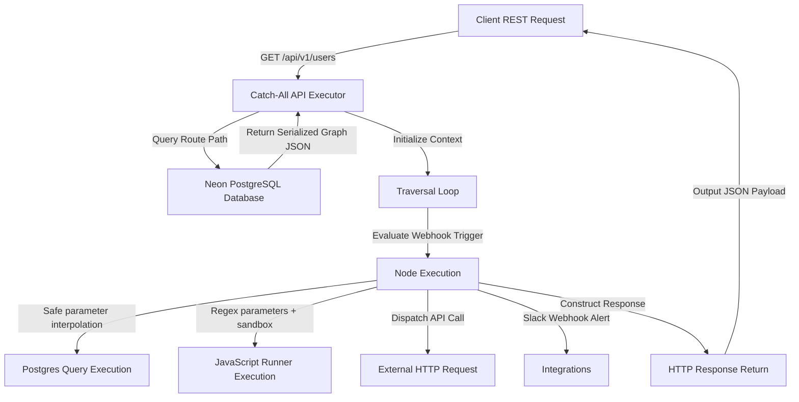

# Weave Visual Backend Builder & Executor Architecture

This document describes the design and operational flow of the Weave Visual Backend Platform. Weave allows developers to visually compile and execute complex backend REST endpoints using a drag-and-drop React Flow builder canvas and an optimized catch-all database-backed routing executor.

---

## 1. High-Level Architectural Flow

The diagram below represents how an incoming HTTP request is routed, loaded from Postgres, traversed sequentially, and executed step-by-step:

---

## 2. Core System Components

### A. Dynamic Catch-All Route Interceptor
- **Path**: `src/app/api/v1/[[...path]]/route.js`
- **Role**: Intercepts all REST request methods (`GET`, `POST`, `PUT`, `DELETE`, `PATCH`) targeting `/api/v1/*`.
- **Normalization**: Joins segment arrays (e.g., `['config', 'master']` -> `/config-master`) to lookup the corresponding configured flow in the `endpoints` database table.

### B. Topological Traversal Engine
- **Path**: `src/app/api/v1/[[...path]]/route.js`
- **Role**: Traces execution sequence starting at the `webhookTrigger` node, following directed edge targets.
- **Context Preservation**: Each node execution saves its output under:
  - `context[nodeId]` (unique ID, e.g., `node_1749582`)
  - `context[nodeType]` (raw type name, e.g., `postgresQuery`)
  - `context[getSimpleName(nodeType)]` (friendly alias, e.g., `query`, `trigger`, `jsRunner`)
  - `context.result` / `context.data` (shortcuts pointing to the output of the node executed immediately prior to the response)

### C. Drag-and-Drop Builder Canvas
- **Path**: `src/app/dashboard/builder/[id]/page.js`
- **Role**: Interactive React Flow workspace featuring a three-panel interface:
  1. **Node Library** (left): Drag category-colored node templates onto the canvas.
  2. **Visual Flow Canvas** (center): Connect input/output ports. Hovering/selecting highlights links with a premium animated marching-ants dashed path.
  3. **Properties Inspector** (right): Configure node values (text, selects, booleans, SQL/JSON/JS code editors) or select and delete connection edges with details telemetry.

---

## 3. Dynamic Execution & Safety Layers

### A. JavaScript Runner Node Sandbox
- **Custom Spacing Layout**: The input handles are wrapped in an `absolute inset-0 pointer-events-none` container, allowing target ports to align at vertical intervals (`offsetTop = index / (count + 1) * 100%`) without breaking card layout flow.
- **Dynamic Parameter Resolution**:
  - The evaluator parses the code string to check if it's a statement block or a function declaration (arrow function `() => ...` or standard `function(...)`).
  - If a function is detected, the regex helper `getParamNames()` extracts the exact parameters expected by the user (e.g. `(input0, input1)`).
  - The evaluator maps each parameter name to the corresponding incoming edge result in `context` and invokes the compiled function securely.
- **Input Mappings**: Connect up to 10 incoming handles to feed arguments directly into the runner code, or utilize the `inputsConfig` JSON field to interpolate and bind custom key-value variables.

### B. Safe SQL Parameterization
- **Interpolation Safeguard**: Rather than performing raw string insertion which leads to syntax errors and SQL injection, Weave uses `prepareParameterizedQuery()`.
- **Placeholder Parsing**: Scans raw SQL templates (e.g., `SELECT * WHERE email = {{trigger.body.email}}` or quoted `email = '{{trigger.body.email}}'`), replacing them with standard `$1`, `$2` placeholders.
- **Escaping**: Values are parsed into a parameter array and sent to Neon Postgres via `sql.unsafe(query, parameters)`, letting the database driver handle escaping.

### C. Legacy Fallback Safeguard
- To maintain backwards compatibility with existing flows configured with the default template `{{transform.result}}` (when no JSON Synthesizer is active), the executor falls back to `context.result` (the latest executed node's output) when resolving variables inside HTTP Response payloads.
